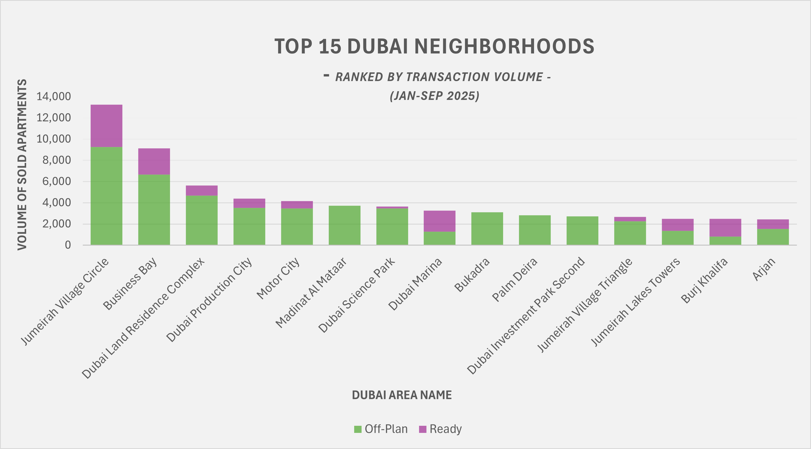
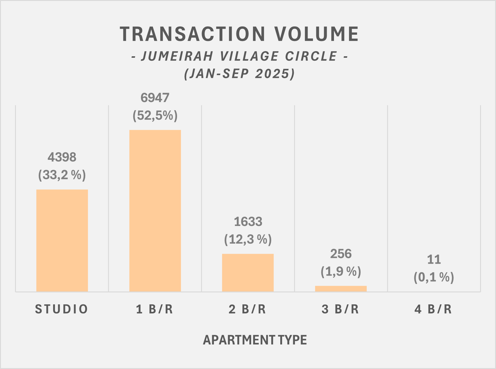
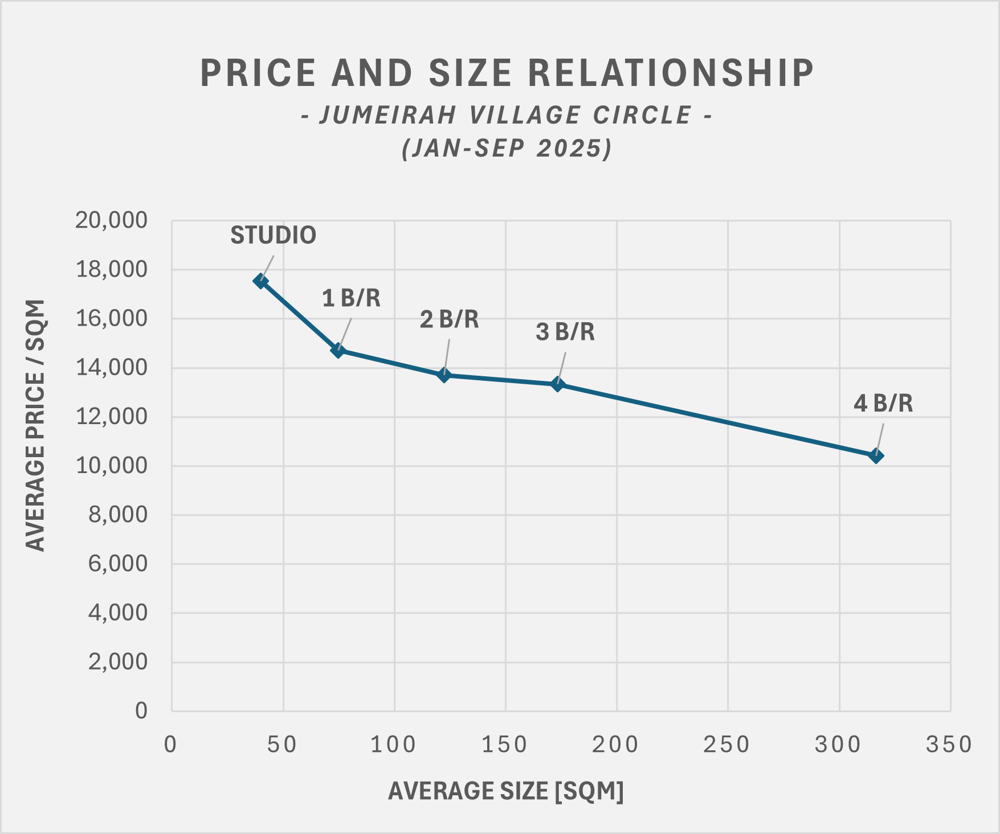

# 🏙️ Dubai Apartment Sales Analysis (Jan–Sep 2025)
**SQL-based analysis of Dubai apartment sales to uncover investment trends and value insights.**
*A data-driven approach to finding smart property investment opportunities.*

---

### 💡 Project Overview
This SQL-based analysis explores **Dubai’s apartment market from January to September 2025**, helping investors identify where opportunities lie — by price trends, area performance, and property characteristics.

Through a series of analytical SQL tables, we turn raw real estate data into actionable insights.  
We focus especially on **Jumeirah Village Circle (JVC)** — the area with the highest number of transactions during this period — to understand how apartment types and sizes shape affordability and returns.

---

## 🧹 SECTION 1: Table Updates – Preparing Reliable Data
Before making any investment decisions, your data must be trustworthy.  
These steps ensure every area and property type is standardized, avoiding misleading comparisons.

**Tables & Functions:**
1. **Function to Convert Selected Text to Title Case** – Creates consistency in text values (e.g., “Business Bay” vs “BUSINESS BAY”).  
2. **Update Area Names in Original Table** – Fixes naming mismatches to ensure each area aggregates correctly.  
3. **Update Area Name of Island 2** – Corrects an isolated naming issue.

🧭 **Investor takeaway:**  
Just like due diligence before buying property, data cleaning prevents costly misinterpretations. Small inconsistencies can distort area-level averages and rankings, leading to wrong investment choices.

---

## 📊 SECTION 2: Descriptive Analysis – Understanding the Market Landscape
This section helps an investor understand **where money flows and what drives prices**.

1. **Average Price Per Square Meter by Area and Status**  
   - **Question:** Which areas offer good value per square meter?  
   - 💡 *Investor tip:* Compare “off-plan” vs “ready” prices — off-plan may offer entry at lower cost but comes with completion risk. Ready units show current demand and liquidity.

2. **Market Share of Off-Plan vs Ready Apartments**  
   - **Question:** Are investors betting on future developments or completed projects?  
   - 💡 *Investor tip:* A high off-plan share indicates developer-driven growth areas; a high ready share suggests established demand and potential for stable rental yields.

3. **Identify Hotspots for Off-Plan Pricing**  
   - **Question:** Where are new developments gaining traction?  
   - 💡 *Investor tip:* Areas with fast-growing off-plan activity often become next investment zones — enter before infrastructure and prices peak.

4. **Compute Price Gaps Between Off-Plan and Ready Properties by Area**  
   - **Question:** Where is the biggest difference between current and future pricing?  
   - 💡 *Investor tip:* A large gap may signal untapped appreciation potential — but balance this with risk appetite and project timelines.

---

## 📈 SECTION 3: Ranking Insights and Trends – Spotting Momentum
Once you understand the market, the next step is **finding where performance leads**.

1. **Ranking Based on Average Price Per Square Meter**  
   - **Question:** Which areas command the highest price per sqm?  
   - 💡 *Investor tip:* High-ranking areas show prestige and price stability, while mid-tier areas may still offer growth potential before reaching maturity.

2. **Ranking Based on Transaction Volume per Status (Off-Plan, Ready)** – *Top 10 per category*  
   - **Question:** Where is the market most active?  
   - 💡 *Investor tip:* High transaction volumes reflect liquidity — easier resale and confidence in that location.

3. **Monthly Price Trends per Area**  
   - **Question:** Are prices rising steadily or fluctuating?  
   - 💡 *Investor tip:* Consistent upward movement signals market confidence. Declining or volatile areas may present short-term opportunities for bargain entry.

---

## 🏡 SECTION 4: JVC Area Analysis – Digging Deeper into an Investment Hotspot
**Why JVC?**  
Jumeirah Village Circle has the highest transaction volume during the reviewed period — a vibrant, evolving community where both first-time buyers and investors are active.

1. **Exploring Apartment Type Distribution**  
   - **Question:** What’s the mix between studios, 1-bed, and 2-bed units?  
   - 💡 *Investor tip:* Studios often yield higher rental returns but attract short-term tenants. Larger units appreciate better in value over time.  
   - **How to use it:** Identify which unit types dominate — areas saturated with small units may offer opportunities in the undersupplied segments.

2. **Exploring Apartment Price vs Size Relationships**  
   - **Question:** How does size affect value?  
   - 💡 *Investor tip:* Smaller units usually cost more per sqm, but the price gap sometimes narrows in maturing areas — ideal for upgrading within the same budget.  
   - **How to use it:** Use the price-per-sqm vs size data to match your budget with the most space-efficient options in each building class.

---

## 📊 Visual Insights

To complement the SQL analysis, the following visuals highlight key market trends and JVC-specific insights:

### 1. Top 15 Dubai Neighborhoods by Transaction Volume

### 2. JVC Transaction Volume Per Apartment Type

  

### 3. JVC Price And Size Relationship

  

---

## 🧭 Practical Investor Workflow
1. **Start broad:** Use Sections 2–3 to identify affordable, active, and growing areas.  
2. **Narrow focus:** Deep-dive into areas like JVC for detailed supply-demand insights.  
3. **Compare risk/reward:** Off-plan for growth, ready units for stability.  
4. **Validate budget fit:** Use price-per-sqm vs size to find where your money goes furthest.

---

## ⚙️ Tech Stack
- **SQL Server** – Core data analysis and transformation  
- **Excel** – Visualization of pricing and trends  
- **GitHub** – Documentation and code sharing

---

📅 *Created October 2025*  
👤 **Author:** Hella Gyergyák  
📍 *Data Source:* Dubai Land Department (DLD) – Publicly available transaction data  

